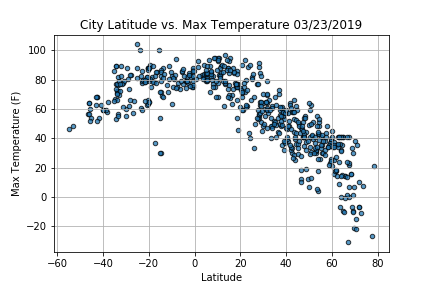
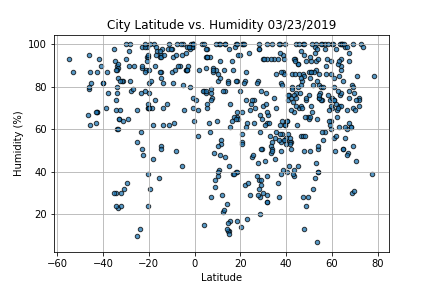
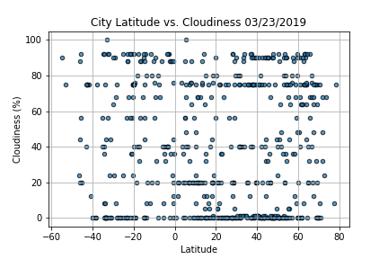
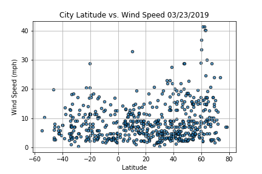

# Python--APIs-WeatherPy

## WeatherPy

Creating a Python script to visualize the weather of 500+ cities across the world of varying distance from the equator. To accomplish this, I'll be utilizing a [simple Python library](https://pypi.python.org/pypi/citipy), the [OpenWeatherMap API](https://openweathermap.org/api), and a little common sense to create a representative model of weather across world cities.

My objective is to build a series of scatter plots to showcase the following relationships:

* Temperature (F) vs. Latitude
* Humidity (%) vs. Latitude
* Cloudiness (%) vs. Latitude
* Wind Speed (mph) vs. Latitude

My final notebook:

* Randomly select **at least** 500 unique (non-repeat) cities based on latitude and longitude.
* Perform a weather check on each of the cities using a series of successive API calls.
* Include a print log of each city as it's being processed with the city number and city name.
* Save both a CSV of all data retrieved and png images for each scatter plot.

-----

```python
# Dependencies and Setup
import matplotlib.pyplot as plt
import pandas as pd
import numpy as np
import requests
import time
import datetime as dt
from api_keys import api_key

# Import API key
import api_keys

# Incorporated citipy to determine city based on latitude and longitude
from citipy import citipy

# Output File (CSV)
output_data_file = "output_data/cities.csv"

# Range of latitudes and longitudes
lat_range = (-90, 90)
lng_range = (-180, 180)
```

## Generate Cities List

```python
# List for holding lat_lngs and cities
lat_lngs = []
cities = []

# Create a set of random lat and lng combinations
lats = np.random.uniform(low=-90.000, high=90.000, size=1500)
lngs = np.random.uniform(low=-180.000, high=180.000, size=1500)
lat_lngs = zip(lats, lngs)

# Identify nearest city for each lat, lng combination
for lat_lng in lat_lngs:
    city = citipy.nearest_city(lat_lng[0], lat_lng[1]).city_name
    
    # If the city is unique, then add it to a our cities list
    if city not in cities:
        cities.append(city)
        
# Print the city count to confirm sufficient count
len(cities)
```

## Perform API Calls

```python
# Save config information.
url = "http://api.openweathermap.org/data/2.5/weather?"
units = "imperial"


# Build partial query URL
query_url = f"{url}appid={api_key}&units={units}&q="


#Lists for holding variables
city_name = []
cloudiness = []
country = []
date = []
humidity = []
lat = []
lng = []
max_temp = []
wind_speed = []

#Initiate count for city number below
count = 1

print(f"Beginning Data Retrieval")   
print("-"*40)

# Loop through the list of cities and perform a request for data on each
for city in cities:
    try:
        response = requests.get(query_url + city).json()
        city_name.append(response["name"])
        cloudiness.append(response["clouds"]["all"])
        country.append(response["sys"]["country"])
        date.append(response["dt"])
        humidity.append(response["main"]["humidity"])
        max_temp.append(response["main"]["temp_max"])
        lat.append(response["coord"]["lat"])
        lng.append(response["coord"]["lon"])
        wind_speed.append(response["wind"]["speed"])
        
        print(f"Processing Record {count} | {city}") 
        
        count += 1
   
    except:
        print(f"City not found. Skipping...")
        continue
print("-"*40)
print(f"Data Retrieval Complete")   
print("-"*40)
```
Beginning Data Retrieval
----------------------------------------
Processing Record 1 | nikolskoye
Processing Record 2 | alyangula
Processing Record 3 | grand gaube
City not found. Skipping...
City not found. Skipping...
Processing Record 4 | huilong
Processing Record 5 | abha
Processing Record 6 | crixas
Processing Record 7 | isla mujeres
Processing Record 8 | busselton
Processing Record 9 | yelizovo
Processing Record 10 | mar del plata
Processing Record 11 | arraial do cabo
Processing Record 12 | rikitea
Processing Record 13 | kruisfontein
Processing Record 14 | mattru
Processing Record 15 | new norfolk
City not found. Skipping...
City not found. Skipping...
Processing Record 16 | vengerovo
Processing Record 17 | codrington
Processing Record 18 | barrow
Processing Record 19 | les cayes
Processing Record 20 | sur
City not found. Skipping...
Processing Record 21 | jamestown
Processing Record 22 | ushuaia
Processing Record 23 | esperance
Processing Record 24 | hilo
Processing Record 25 | great falls
Processing Record 26 | mataura
City not found. Skipping...
Processing Record 27 | prince rupert
Processing Record 28 | namibe
Processing Record 29 | nacala
Processing Record 30 | ancud
Processing Record 31 | albany
Processing Record 32 | eyl
Processing Record 33 | ponta delgada
Processing Record 34 | hermanus
Processing Record 35 | dwarka
Processing Record 36 | belyy yar
Processing Record 37 | rokytne
Processing Record 38 | grindavik
Processing Record 39 | antofagasta
City not found. Skipping...
Processing Record 40 | flin flon
Processing Record 41 | talnakh
Processing Record 42 | port alfred
Processing Record 43 | butaritari
Processing Record 44 | souillac
Processing Record 45 | ikwiriri
Processing Record 46 | vaini
Processing Record 47 | airai
Processing Record 48 | nishihara
Processing Record 49 | cape town
City not found. Skipping...
Processing Record 50 | mabaruma
Processing Record 51 | suluq
Processing Record 52 | narsaq
Processing Record 53 | yenagoa
Processing Record 54 | georgetown
Processing Record 55 | cherskiy
Processing Record 56 | punta arenas
Processing Record 57 | atuona
Processing Record 58 | manokwari
City not found. Skipping...
Processing Record 59 | dong hoi
Processing Record 60 | longyearbyen
Processing Record 61 | hamilton
City not found. Skipping...
Processing Record 62 | magnor
Processing Record 63 | avarua
Processing Record 64 | ilulissat
Processing Record 65 | chulym
Processing Record 66 | port blair
Processing Record 67 | ardesen
Processing Record 68 | huarmey
Processing Record 69 | upernavik
Processing Record 70 | leningradskiy
City not found. Skipping...
Processing Record 71 | bafq
Processing Record 72 | takapau
Processing Record 73 | ocos
Processing Record 74 | kamyshlov
Processing Record 75 | kaoma
Processing Record 76 | marzuq
Processing Record 77 | touros
Processing Record 78 | hofn
Processing Record 79 | plettenberg bay
Processing Record 80 | lavrentiya
Processing Record 81 | colares
Processing Record 82 | hervey bay
Processing Record 83 | bar harbor
Processing Record 84 | carinhanha
Processing Record 85 | hobart
Processing Record 86 | davila
Processing Record 87 | pevek
Processing Record 88 | te anau
Processing Record 89 | mnogovershinnyy
Processing Record 90 | cabo san lucas
Processing Record 91 | saldanha
Processing Record 92 | sisimiut
Processing Record 93 | miri
Processing Record 94 | sherman
Processing Record 95 | bethel
Processing Record 96 | yumen
Processing Record 97 | sanghar
Processing Record 98 | erenhot
Processing Record 99 | kasongo-lunda
City not found. Skipping...
Processing Record 100 | ukiah
Processing Record 101 | nanortalik
Processing Record 102 | vao
Processing Record 103 | susangerd
Processing Record 104 | bay roberts
Processing Record 105 | port lincoln
Processing Record 106 | ribeira grande
Processing Record 107 | tasiilaq
Processing Record 108 | kapaa
City not found. Skipping...
Processing Record 109 | nemuro
Processing Record 110 | caravelas
Processing Record 111 | east london
City not found. Skipping...
Processing Record 112 | wahiawa
Processing Record 113 | luderitz
Processing Record 114 | geraldton
Processing Record 115 | fayaoue
Processing Record 116 | qaanaaq
Processing Record 117 | petropavlovsk-kamchatskiy
Processing Record 118 | college
Processing Record 119 | bredasdorp
Processing Record 120 | half moon bay
Processing Record 121 | mandera
Processing Record 122 | puerto del rosario
Processing Record 123 | bushehr
Processing Record 124 | faya
Processing Record 125 | erie
Processing Record 126 | guerrero negro
Processing Record 127 | bambous virieux
Processing Record 128 | grodkow
Processing Record 129 | hefei
Processing Record 130 | faanui
Processing Record 131 | lorengau
Processing Record 132 | bulgan
Processing Record 133 | coihaique
Processing Record 134 | puerto ayora
City not found. Skipping...
Processing Record 135 | dikson
Processing Record 136 | oksfjord
Processing Record 137 | sai buri
Processing Record 138 | aklavik
Processing Record 139 | tsiroanomandidy
City not found. Skipping...
Processing Record 140 | cidreira
Processing Record 141 | katsuura
Processing Record 142 | ponta do sol
Processing Record 143 | avera
Processing Record 144 | severo-kurilsk
Processing Record 145 | elko
Processing Record 146 | vestmannaeyjar
City not found. Skipping...
City not found. Skipping...
Processing Record 147 | shirokiy
Processing Record 148 | muros
Processing Record 149 | tiksi
Processing Record 150 | areosa
Processing Record 151 | casa nova
Processing Record 152 | hithadhoo
Processing Record 153 | bluff
Processing Record 154 | hami
Processing Record 155 | abong mbang
Processing Record 156 | saint anthony
Processing Record 157 | lebu
Processing Record 158 | bosaso
Processing Record 159 | kavieng
Processing Record 160 | merauke
Processing Record 161 | kishtwar
Processing Record 162 | lata
Processing Record 163 | iqaluit
Processing Record 164 | bereda
Processing Record 165 | hirara
Processing Record 166 | esmeraldas
Processing Record 167 | ler
Processing Record 168 | barreirinha
Processing Record 169 | tahoua
Processing Record 170 | onega
Processing Record 171 | yabrud
Processing Record 172 | pisco
Processing Record 173 | husavik
Processing Record 174 | winslow
Processing Record 175 | tuatapere
Processing Record 176 | mahebourg
Processing Record 177 | mahanoro
Processing Record 178 | itigi
Processing Record 179 | komsomolskiy
Processing Record 180 | torbay
Processing Record 181 | praia
City not found. Skipping...
Processing Record 182 | yellowknife
Processing Record 183 | shieli
Processing Record 184 | penzance
City not found. Skipping...
Processing Record 185 | sarangani
Processing Record 186 | vostok
Processing Record 187 | hambantota
Processing Record 188 | sligo
Processing Record 189 | banjar
Processing Record 190 | dharchula
Processing Record 191 | lompoc
Processing Record 192 | nyurba
Processing Record 193 | medea
Processing Record 194 | ayorou
City not found. Skipping...
City not found. Skipping...
Processing Record 195 | kavaratti
Processing Record 196 | millet
Processing Record 197 | bukachacha
Processing Record 198 | ulaanbaatar
Processing Record 199 | port macquarie
City not found. Skipping...
Processing Record 200 | fare
Processing Record 201 | bend
Processing Record 202 | seoul
Processing Record 203 | thompson
Processing Record 204 | jumla
Processing Record 205 | fukue
City not found. Skipping...
Processing Record 206 | saskylakh
Processing Record 207 | lasa
Processing Record 208 | dillon
Processing Record 209 | liverpool
Processing Record 210 | laguna
Processing Record 211 | mayya
Processing Record 212 | adrasmon
Processing Record 213 | haines junction
Processing Record 214 | port elizabeth
Processing Record 215 | hasaki
Processing Record 216 | ponnani
Processing Record 217 | dwarahat
Processing Record 218 | kodiak
Processing Record 219 | burgeo
Processing Record 220 | vila velha
Processing Record 221 | alofi
Processing Record 222 | bandipur
City not found. Skipping...
Processing Record 223 | klaksvik
Processing Record 224 | swan river
Processing Record 225 | chokurdakh
Processing Record 226 | moree
Processing Record 227 | alice springs
Processing Record 228 | bakel
Processing Record 229 | zhigansk
Processing Record 230 | along
Processing Record 231 | kaitangata
Processing Record 232 | meulaboh
Processing Record 233 | rafai
Processing Record 234 | nichinan
Processing Record 235 | saint-augustin
Processing Record 236 | acapulco
Processing Record 237 | nyimba
Processing Record 238 | carnarvon
City not found. Skipping...
Processing Record 239 | yorosso
Processing Record 240 | teknaf
City not found. Skipping...
Processing Record 241 | necochea
Processing Record 242 | magistralnyy
Processing Record 243 | gombe
Processing Record 244 | salalah
Processing Record 245 | yeppoon
Processing Record 246 | mayumba
Processing Record 247 | isangel
City not found. Skipping...
Processing Record 248 | sawakin
Processing Record 249 | kattivakkam
Processing Record 250 | lagoa
Processing Record 251 | mildura
Processing Record 252 | saint george
Processing Record 253 | mapiri
Processing Record 254 | fairbanks
Processing Record 255 | omboue
Processing Record 256 | umm lajj
Processing Record 257 | ixtapa
Processing Record 258 | sinop
Processing Record 259 | port hawkesbury
Processing Record 260 | solnechnyy
Processing Record 261 | iranshahr
Processing Record 262 | antalaha
Processing Record 263 | los llanos de aridane
Processing Record 264 | castro
Processing Record 265 | chuy
City not found. Skipping...
Processing Record 266 | cockburn town
Processing Record 267 | peleduy
Processing Record 268 | atar
Processing Record 269 | guadalupe y calvo
Processing Record 270 | kloulklubed
Processing Record 271 | sal rei
Processing Record 272 | payakumbuh
Processing Record 273 | kuzhener
Processing Record 274 | saint-francois
Processing Record 275 | nokaneng
Processing Record 276 | saint-philippe
Processing Record 277 | tazovskiy
Processing Record 278 | bikaner
Processing Record 279 | road town
Processing Record 280 | lushoto
Processing Record 281 | sudbury
Processing Record 282 | xining
Processing Record 283 | solwezi
Processing Record 284 | khatanga
Processing Record 285 | chapais
Processing Record 286 | padang
Processing Record 287 | knysna
Processing Record 288 | tura
Processing Record 289 | emilio carranza
Processing Record 290 | san isidro
Processing Record 291 | sylacauga
Processing Record 292 | imbituba
Processing Record 293 | toamasina
Processing Record 294 | tual
Processing Record 295 | gold coast
Processing Record 296 | nome
Processing Record 297 | port moresby
Processing Record 298 | koszalin
Processing Record 299 | caucaia
Processing Record 300 | itoman
Processing Record 301 | teacapan
Processing Record 302 | sao filipe
City not found. Skipping...
Processing Record 303 | anadyr
Processing Record 304 | richards bay
City not found. Skipping...
Processing Record 305 | shar
Processing Record 306 | dingle
Processing Record 307 | azangaro
Processing Record 308 | taree
Processing Record 309 | bilma
Processing Record 310 | bandiagara
Processing Record 311 | kibala
City not found. Skipping...
Processing Record 312 | aviles
Processing Record 313 | mount gambier
City not found. Skipping...
Processing Record 314 | bako
Processing Record 315 | batagay
Processing Record 316 | axim
Processing Record 317 | nuuk
Processing Record 318 | bathsheba
Processing Record 319 | port hedland
Processing Record 320 | morehead
Processing Record 321 | tala
Processing Record 322 | annau
Processing Record 323 | nyuksenitsa
City not found. Skipping...
Processing Record 324 | carutapera
Processing Record 325 | sorong
Processing Record 326 | leeton
Processing Record 327 | fort nelson
Processing Record 328 | rafaela
City not found. Skipping...
Processing Record 329 | palana
City not found. Skipping...
Processing Record 330 | victoria
Processing Record 331 | cascais
Processing Record 332 | rodrigues alves
Processing Record 333 | la ronge
City not found. Skipping...
Processing Record 334 | ola
Processing Record 335 | botngard
Processing Record 336 | guanica
City not found. Skipping...
Processing Record 337 | marsa matruh
Processing Record 338 | lockhart
City not found. Skipping...
Processing Record 339 | calella
Processing Record 340 | khasan
Processing Record 341 | sitka
Processing Record 342 | nalut
Processing Record 343 | barwani
Processing Record 344 | ahipara
Processing Record 345 | chifeng
City not found. Skipping...
Processing Record 346 | malino
Processing Record 347 | yatou
Processing Record 348 | kautokeino
Processing Record 349 | voh
Processing Record 350 | beringovskiy
Processing Record 351 | takaka
City not found. Skipping...
Processing Record 352 | udachnyy
City not found. Skipping...
Processing Record 353 | aleysk
Processing Record 354 | khorixas
Processing Record 355 | kirksville
Processing Record 356 | nicoya
Processing Record 357 | balkhash
Processing Record 358 | loksa
Processing Record 359 | tungor
Processing Record 360 | san ramon de la nueva oran
Processing Record 361 | dalvik
Processing Record 362 | waingapu
City not found. Skipping...
Processing Record 363 | snezhnogorsk
Processing Record 364 | terney
Processing Record 365 | luba
Processing Record 366 | coahuayana
Processing Record 367 | atamanovka
Processing Record 368 | biak
Processing Record 369 | otjimbingwe
Processing Record 370 | karpathos
Processing Record 371 | banepa
Processing Record 372 | anshun
Processing Record 373 | tianguismanalco
Processing Record 374 | tessalit
Processing Record 375 | atlantis
Processing Record 376 | bata
Processing Record 377 | bischofshofen
Processing Record 378 | inuvik
Processing Record 379 | provideniya
Processing Record 380 | kulgam
Processing Record 381 | tanout
Processing Record 382 | sorland
Processing Record 383 | mitsamiouli
Processing Record 384 | murwillumbah
Processing Record 385 | saeby
Processing Record 386 | harrison
Processing Record 387 | port augusta
Processing Record 388 | boyuibe
Processing Record 389 | ambam
Processing Record 390 | kahului
Processing Record 391 | yaqui
Processing Record 392 | patacamaya
Processing Record 393 | lerwick
Processing Record 394 | dunkirk
Processing Record 395 | paracuru
Processing Record 396 | phangnga
Processing Record 397 | poshekhonye
Processing Record 398 | glomfjord
Processing Record 399 | yerbogachen
Processing Record 400 | baykit
Processing Record 401 | phan thiet
Processing Record 402 | natchitoches
Processing Record 403 | bourail
City not found. Skipping...
Processing Record 404 | roald
Processing Record 405 | vanimo
Processing Record 406 | chase
Processing Record 407 | trnava
Processing Record 408 | svetlyy yar
Processing Record 409 | akdepe
Processing Record 410 | zeya
Processing Record 411 | ayagoz
Processing Record 412 | kostelec nad orlici
Processing Record 413 | ust-koksa
Processing Record 414 | gusau
City not found. Skipping...
Processing Record 415 | morant bay
Processing Record 416 | sehithwa
Processing Record 417 | sao joao da barra
Processing Record 418 | hovd
Processing Record 419 | vila franca do campo
Processing Record 420 | yulara
Processing Record 421 | tucurui
Processing Record 422 | tuktoyaktuk
Processing Record 423 | marion
Processing Record 424 | atikokan
Processing Record 425 | kondinskoye
Processing Record 426 | ust-kut
Processing Record 427 | mehamn
Processing Record 428 | beloha
Processing Record 429 | srednekolymsk
Processing Record 430 | west odessa
Processing Record 431 | san patricio
Processing Record 432 | price
Processing Record 433 | rocha
Processing Record 434 | hobyo
Processing Record 435 | cayenne
Processing Record 436 | ranchuelo
Processing Record 437 | owosso
Processing Record 438 | yerofey pavlovich
Processing Record 439 | fortuna
Processing Record 440 | denizli
Processing Record 441 | pasighat
Processing Record 442 | san ramon
Processing Record 443 | maniitsoq
Processing Record 444 | portland
Processing Record 445 | san pedro
Processing Record 446 | constitucion
Processing Record 447 | taoudenni
Processing Record 448 | giehun
Processing Record 449 | porto walter
Processing Record 450 | manzhouli
Processing Record 451 | opuwo
Processing Record 452 | lesnyye polyany
Processing Record 453 | apud
Processing Record 454 | kisangani
City not found. Skipping...
City not found. Skipping...
Processing Record 455 | cap malheureux
Processing Record 456 | deori khas
City not found. Skipping...
Processing Record 457 | bongandanga
Processing Record 458 | oranjestad
Processing Record 459 | sulangan
Processing Record 460 | sumbe
City not found. Skipping...
Processing Record 461 | broken hill
Processing Record 462 | dunedin
Processing Record 463 | champerico
Processing Record 464 | kalat
Processing Record 465 | salinopolis
Processing Record 466 | irinjalakuda
Processing Record 467 | oranjemund
Processing Record 468 | tsalka
City not found. Skipping...
Processing Record 469 | santa luzia
Processing Record 470 | ginir
Processing Record 471 | sungaipenuh
Processing Record 472 | georgiyevskoye
Processing Record 473 | taloqan
Processing Record 474 | coolidge
Processing Record 475 | kitimat
Processing Record 476 | evensk
Processing Record 477 | tadine
Processing Record 478 | bud
Processing Record 479 | yeniseysk
Processing Record 480 | krasnogvardeyets
Processing Record 481 | kwinana
Processing Record 482 | jimani
Processing Record 483 | margate
Processing Record 484 | naze
Processing Record 485 | kutum
Processing Record 486 | capleni
Processing Record 487 | puerto lempira
Processing Record 488 | gizo
Processing Record 489 | tallahassee
Processing Record 490 | chupa
Processing Record 491 | porto murtinho
Processing Record 492 | nizhniy kuranakh
Processing Record 493 | whitehorse
Processing Record 494 | waipawa
City not found. Skipping...
Processing Record 495 | gorele
Processing Record 496 | nevers
Processing Record 497 | ermoupolis
Processing Record 498 | hermosillo
Processing Record 499 | cedral
Processing Record 500 | mocuba
Processing Record 501 | derzhavinsk
City not found. Skipping...
Processing Record 502 | kirakira
Processing Record 503 | sinnamary
City not found. Skipping...
Processing Record 504 | lazaro cardenas
Processing Record 505 | svetlaya
Processing Record 506 | ambilobe
Processing Record 507 | toora-khem
Processing Record 508 | coquimbo
Processing Record 509 | bom jesus
Processing Record 510 | aykhal
Processing Record 511 | chizhou
Processing Record 512 | vorontsovka
Processing Record 513 | adrar
Processing Record 514 | tiarei
Processing Record 515 | kysyl-syr
Processing Record 516 | nelson bay
Processing Record 517 | chara
City not found. Skipping...
Processing Record 518 | grenfell
Processing Record 519 | sokoto
Processing Record 520 | shetpe
Processing Record 521 | talaya
Processing Record 522 | scortaru nou
City not found. Skipping...
Processing Record 523 | basco
Processing Record 524 | porosozero
Processing Record 525 | kununurra
Processing Record 526 | nova odesa
Processing Record 527 | katobu
Processing Record 528 | havre
Processing Record 529 | hot springs
Processing Record 530 | dakar
Processing Record 531 | yelnya
Processing Record 532 | tortoli
Processing Record 533 | erzin
Processing Record 534 | bandarbeyla
Processing Record 535 | saint-joseph
Processing Record 536 | bereznik
Processing Record 537 | clyde river
Processing Record 538 | eydhafushi
Processing Record 539 | kosmonosy
Processing Record 540 | manavgat
Processing Record 541 | san andres
Processing Record 542 | mufumbwe
Processing Record 543 | otukpo
Processing Record 544 | mattawa
Processing Record 545 | kirsanov
Processing Record 546 | jingdezhen
City not found. Skipping...
Processing Record 547 | machalpur
Processing Record 548 | aksarka
Processing Record 549 | manacapuru
Processing Record 550 | laerdalsoyri
Processing Record 551 | elblag
Processing Record 552 | altotting
Processing Record 553 | piltene
Processing Record 554 | palauig
City not found. Skipping...
Processing Record 555 | sterling
Processing Record 556 | rosetta
Processing Record 557 | rawson
Processing Record 558 | dumai
Processing Record 559 | gwadar
City not found. Skipping...
Processing Record 560 | sterlibashevo
----------------------------------------
Data Retrieval Complete
----------------------------------------


## Convert Raw Data to DataFrame

```python
#build a data frame's titles
weather_dict = {
    "City": city_name,
    "Cloudiness":cloudiness, 
    "Country":country,
    "Date":date, 
    "Humidity": humidity,
    "Lat":lat, 
    "Lng":lng, 
    "Max Temp": max_temp,
    "Wind Speed":wind_speed
}

# Create df 
weather_data = pd.DataFrame(weather_dict)

# Display count
weather_data.count()
```
City          560
Cloudiness    560
Country       560
Date          560
Humidity      560
Lat           560
Lng           560
Max Temp      560
Wind Speed    560


```python
# Save data frame to CSV
weather_data.to_csv('weather_data.csv')

# Display data frame head 
weather_data.head()
```

## Plotting the Data

# Latitude vs. Temperature Plot
```python
#add today's date in to charts
date = dt.date.today().strftime("%m/%d/%Y")

plt.scatter(weather_data["Lat"], weather_data["Max Temp"], marker="o",s=20,alpha=.75, edgecolors="k")
plt.title(f"City Latitude vs. Max Temperature {date}")
plt.ylabel("Max Temperature (F)")
plt.xlabel("Latitude")
plt.grid(True)

plt.savefig("City Latitude vs Max Temperature.png")
plt.show()
```


# Latitude vs. Humidity Plot

```python
plt.scatter(weather_data["Lat"], weather_data["Humidity"], marker="o", s=20,alpha=.75, edgecolors="k")
plt.title(f"City Latitude vs. Humidity {date}")
plt.ylabel("Humidity (%)")
plt.xlabel("Latitude")
plt.grid(True)

plt.savefig("City Latitude vs Humidity.png")
plt.show()
```


# Latitude vs. Cloudiness Plot

```python
plt.scatter(weather_data["Lat"], weather_data["Cloudiness"], marker="o", s=20,alpha=.75, edgecolors="k")
plt.title(f"City Latitude vs. Cloudiness {date}")
plt.ylabel("Cloudiness (%)")
plt.xlabel("Latitude")
plt.grid(True)

plt.savefig("City Latitude vs Cloudiness.png")
plt.show()
```


# Latitude vs. Wind Speed Plot

```python
plt.scatter(weather_data["Lat"], weather_data["Wind Speed"], marker="o", s=20,alpha=.75, edgecolors="k")
plt.title(f"City Latitude vs. Wind Speed {date}")
plt.ylabel("Wind Speed (mph)")
plt.xlabel("Latitude")
plt.grid(True)

plt.savefig("City Latitude vs Wind Speed.png")
plt.show()
```



